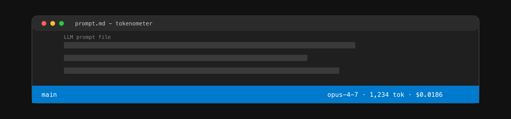

# Tokenometer for VS Code & Cursor

[](https://github.com/faraa2m/tokenometer/blob/main/LICENSE)

> Live token count **and USD cost** for the active prompt file, right in the status bar — across Claude, GPT-4o, and Gemini.

Most "token counter" extensions stop at counts. Tokenometer adds the dollar value, using the same pricing the [`tokenometer` CLI](https://www.npmjs.com/package/tokenometer) and GitHub Action use, so what you see in the editor matches what you'd see in CI and on the npm side.



## Install

### Marketplace (coming with v1.0.0)

The Marketplace install button arrives with the v1.0.0 cut — Phase I owns that publish step. Track it on the [milestones page](https://github.com/faraa2m/tokenometer/milestones).

- **VS Code Marketplace:** _coming with v1.0.0_
- **Open VSX (Cursor / VSCodium):** _coming with v1.0.0_

### Build locally now (`.vsix`)

While the Marketplace listing is in flight, build a `.vsix` from this repo and side-load it:

```bash
npm install
npm run build --workspace=@tokenometer/vscode
npm run package:vsix --workspace=@tokenometer/vscode
code --install-extension packages/vscode/tokenometer-*.vsix
```

The same `.vsix` works in Cursor and VSCodium.

## What it shows

The status bar (right side) shows three things, separated by ` · `:

```
opus-4-7 · 1,234 tok · $0.0186
```

- **Model** — the active model id, shortened (full id in the tooltip).
- **Tokens** — input token count for the current file. A leading `~` means the count is approximate (e.g. Claude / Gemini in offline mode).
- **Cost** — input cost in USD at the model's published per-1k-input rate.

Hovering reveals the full model id, the exact token count, the 8-decimal cost, the tokenizer name, and a hint to click to switch model.

## Settings

| Setting                       | Default            | Description                                                                                              |
| ----------------------------- | ------------------ | -------------------------------------------------------------------------------------------------------- |
| `tokenometer.model`           | `claude-opus-4-7`  | Model id to count and price against. Run **Tokenometer: Switch model** for the full registry list.      |
| `tokenometer.format`          | `text`             | Format conversion before counting (`text`, `markdown`, `json`, `yaml`, `xml`).                          |
| `tokenometer.warnOnCostAbove` | `0`                | If non-zero, the status bar turns warning-colored when the file's input cost exceeds this USD value.    |

Settings can be changed per-workspace (Workspace Settings) or globally (User Settings) — switching via the command saves to the workspace if one is open, otherwise globally.

## Commands

- **Tokenometer: Switch model** — quick-pick over every model in `@tokenometer/core`'s registry.
- **Tokenometer: Show details for current file** — modal with the full breakdown.

Both commands appear under the `Tokenometer:` prefix in the command palette.

## Supported files

The extension activates only on prompt-shaped content: `.md`, `.markdown`, `.txt`, `.json`, `.jsonc`, `.yaml`, `.yml`, `.xml` (matched by language id _or_ extension). Anything else gets a hidden status bar item — no work, no noise.

Files larger than 1 MB are skipped to keep the editor responsive (`—` shown in place of the count).

## How it works

Under the hood the extension reuses [`@tokenometer/core`](https://www.npmjs.com/package/@tokenometer/core)'s `tokenize()` function — the same path the CLI takes. Counts, pricing, and tokenizer choices are identical to the rest of the suite.

## Links

- [Root README](https://github.com/faraa2m/tokenometer#readme) — methodology, findings, and the full project overview.
- [`tokenometer` CLI on npm](https://www.npmjs.com/package/tokenometer)
- [Live playground](https://tokenometer.vercel.app)

## License

MIT
